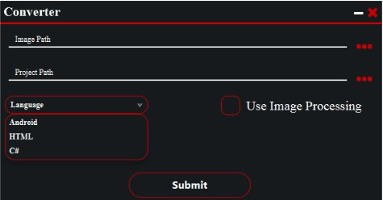
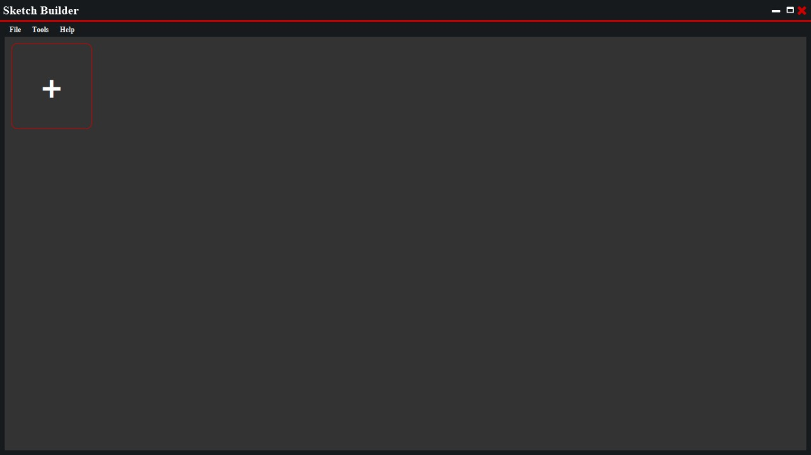
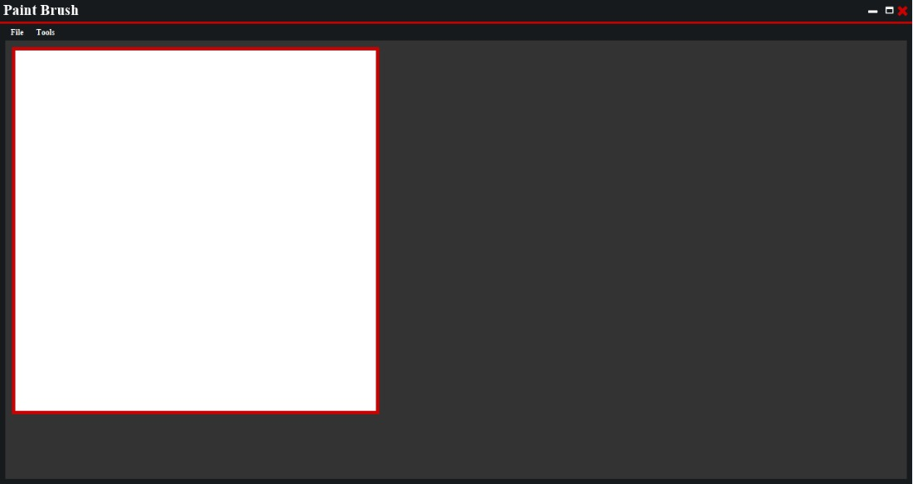

# Sketch Builder (UI part)

Sketch Builder is an application that use AI and computer Vision technologies to convert sketch design to real code in multiple programming languages, the UI part is the part which is responsible for the user interface where user can work with the application easly.

## Getting Started

These instructions will get you a copy of the project up and running on your local machine for development and testing purposes.

### Prerequisites

- jdk 8
- JAVA_HOME environment variable refer to jdk8 home

### Installing

- clone the project to your device and unzip it.
- open the main project folder and open terminal inside it.
- write this command :

1- on Linux
```
$ ./gradlew build
```
2- on windows

```
$ gradlew build
```

### How to use

- open "build/libs" directory in terminal and write the following command

```
$ java -jar generator.jar
```

## Application main Frames

<p align="center"></p>
<p align="center"></p>
<p align="center"></p>

### Note
- this application is just the ui of sketch builder project and will not do any operation without other parts


